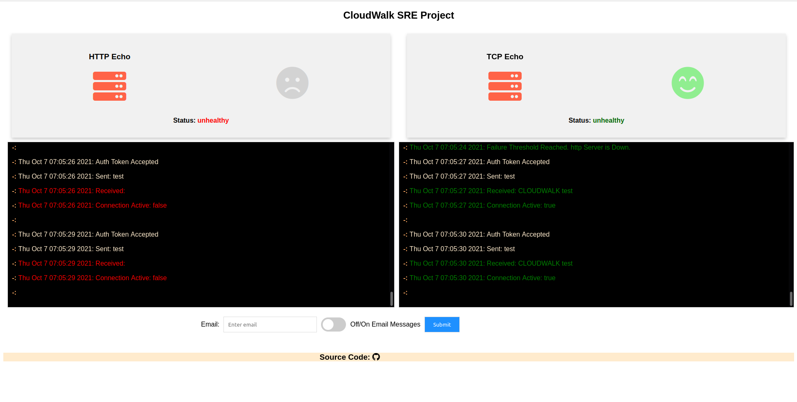

### **Cloudwalk SRE Test**
The goal of the Cloudwalk SRE challenge is to monitor and try to make contact with two Endpoints- a Tcp and Http Endpoint. The two endpoints simply echoes back a supplied string prepended to a fixed string. Upon reaching a fixed failure-success threshold, the program sends the appropriate email notification. This is what the frontend looks like:

#### **Configuration**
The program is hosted entirely on google cloud as an `App Engine` project and is configured to be deployed with one command: `gcloud app deploy`. To quickly visualize the app in the browser you can run: `gcloud app browse`. But first to setup gcloud for go (golang) development, one can follow this link: [Quickstart for Go 1.12+ in the App Engine Standard Environment](https://cloud.google.com/appengine/docs/standard/go/quickstart "Quickstart for Go 1.12+ in the App Engine Standard Environment").

In firebase, you must manually configure cloud firestore to include two collection. The first collection- `current_status` has two documents, each with document ids `tcp` and `http`. Both documents have the same fields: a string type field called `state`, two numerical fields called `uptime_count` and `downtime_count` and a timestamp field named `timestamp`.

The second collection- `config` has a document named `config` with two fields: a string type field named `email` and a boolean field named `update`.

And finally you must setup [Mailgun](https://www.mailgun.com/ "Mailgun") for our notification service. After you have signed up for Mailgun and obtain the proper credentials, open the `app.yaml` file and fill in the appropriate fields.

#### **Tests**
Golang test files ends with `filename_test.go`. Filename being the name of the file being tested. Whenever you are in a directory containing a test file, you can run the test by typing:  `go test -v .`. Not the dot after the -v is pointing to the current directory.

#### **Documentation**
There are two ways to generate documentation. `godoc` and `go doc`. The difference being that the former is web based and can generate visually appealing html pages. The latter is command line based. For example when in the appropriate directory, the command `go doc --all`will generate all documented exported functions and collections.

#### **Reflection**
Golang is a great tool for web and cloud engineering and I'm sure in other contended domains as well. I really had such a good time working on this project. I got to use one of my favorite nosql database- cloud firestore. I learnt something new about making ajax request to the backend- though I didn't get to use it in this project. But my favorite part of this project by far was designing the log feed in html. Basically I wanted to design something that mimicks terminal output. And the result turned out just great.
